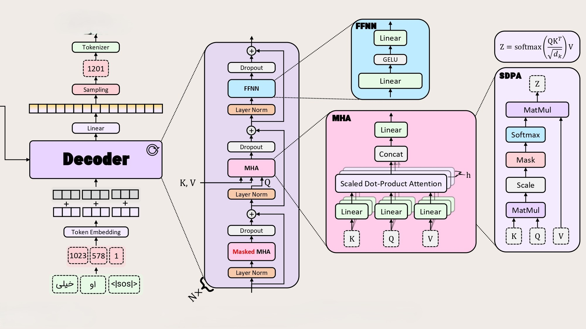
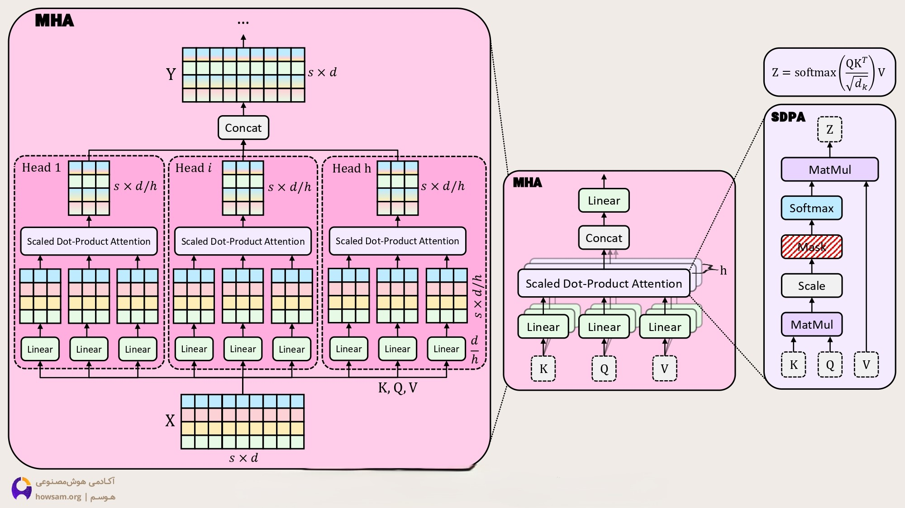
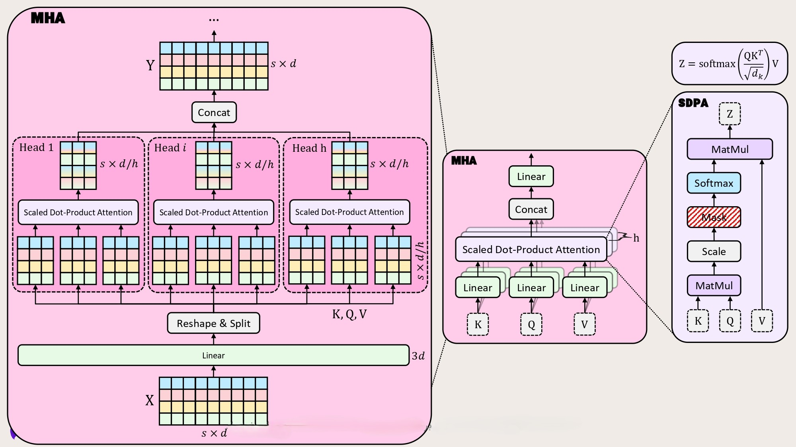
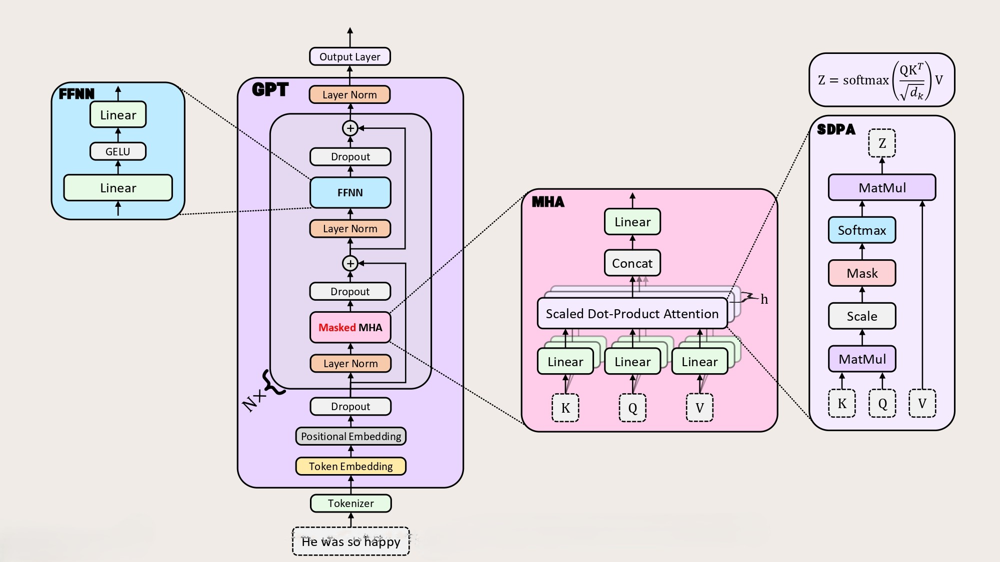
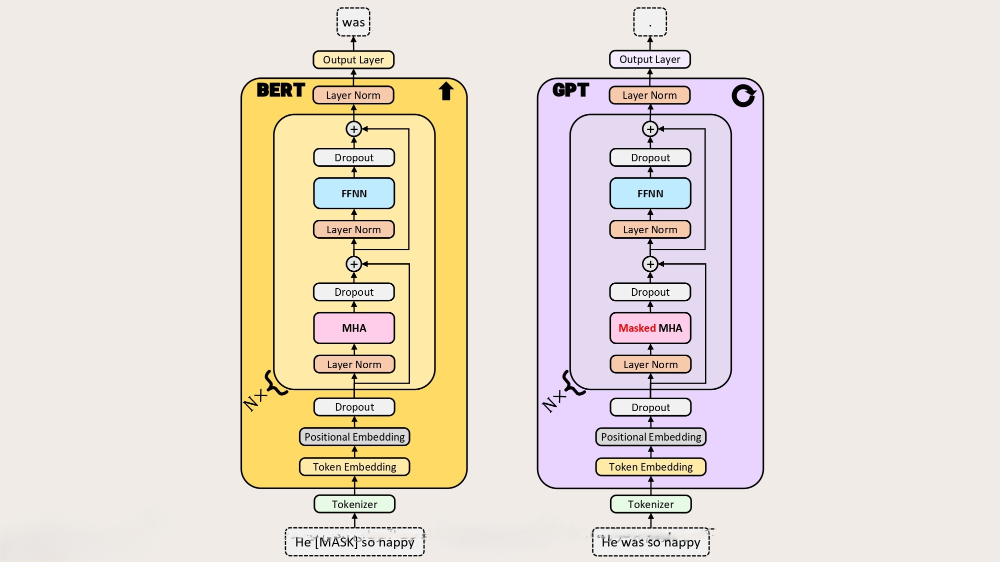
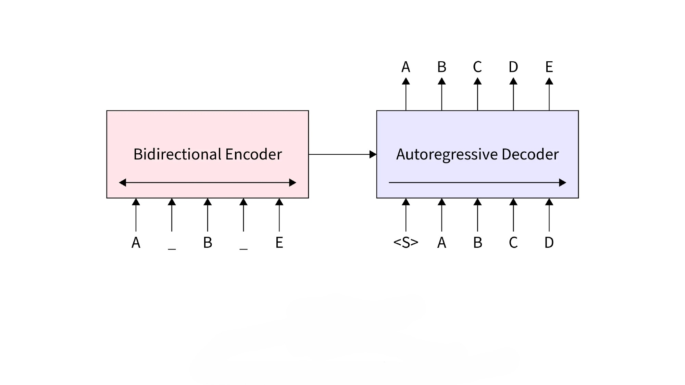

# Implementation of Transformer from Scratch in PyTorch

This project provides a complete implementation of the Transformer architecture from scratch using PyTorch. The implementation covers the full architecture explanation, training procedures, and inference steps.

## Repository Structure

- **`transformers/tokenizer.py`**: Implementation of the tokenizer for preprocessing text data
- **`transformers/model.py`**: Core Transformer model implementation including attention mechanisms, encoder, and decoder
- **`transformers/training.py`**: Training utilities and procedures
- **`transformers/inference.py`**: Functions for running inference with trained models
- **`transformers/utils.py`**: Helper functions and utilities
- **`examples/`**: Example usage scripts and notebooks
- **`tests/`**: Unit tests for the implementation

## Features

- Complete implementation of the Transformer architecture as described in "Attention is All You Need"
- Self-attention and multi-head attention mechanisms
- Positional encoding
- Layer normalization and residual connections
- Training procedures with customizable hyperparameters
- Inference pipeline for using trained models

## Visuals

Below are some visuals illustrating the architecture and components:








## Getting Started

1. Clone the repository: 
   ```bash
   git clone <repository-url>
   cd Transformer_from_scratch_PyTorch
   ```

2. Install dependencies:
   ```bash
   pip install -r requirements.txt
   ```

3. Explore the implementation:
   - See the model implementation in `transformers/model.py`
   - Check out example usage in the `examples/` directory
   - Read through the code documentation for detailed explanations

4. Train your own model:
   ```bash
   python -m transformers.training --config config.json
   ```

5. Run inference:
   ```bash
   python -m transformers.inference --model model.pt --input "Your input text"
   ```

## Architecture Details

This implementation follows the original Transformer architecture with:
- Multi-head attention mechanisms
- Position-wise feed-forward networks
- Layer normalization
- Residual connections
- Positional encoding

For detailed explanations of each component, refer to the documentation and comments in the code.

## Contributing

Feel free to contribute by submitting issues or pull requests. Contributions to improve the implementation, documentation, or examples are welcome.

## License

This project is licensed under [Your License Here]. Replace this section with the appropriate license information.
